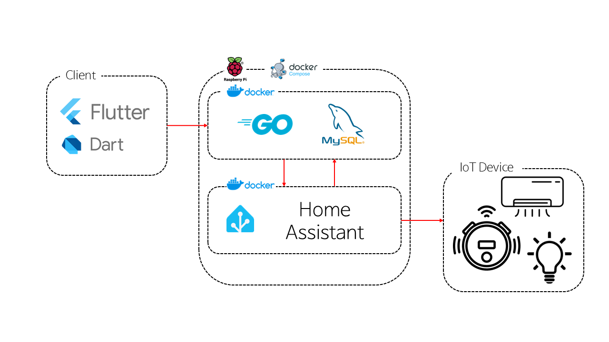

# IoT Server

IoT Server는 Home Assistant와 연동하여 IoT 기기를 제어하는 서버입니다.

## 프로젝트 시스템 아키텍처


## 프로젝트 구조(서버)

```
iot_server/
├── .github/workflows      # github actions 통한 자동화
├── config/                # 설정 파일 디렉토리
│   ├── config.go         # 서버 설정 정의
│   ├── config_test.go    # 설정 테스트
│   └── secret.go         # 시크릿 정보 관리
├── entity/                # 도메인 엔티티 정의
│   └── vacuum.go         # 진공청소기 엔티티 정의
├── handler/               # HTTP 핸들러
│   ├── response.go       # 공통 응답 처리
│   ├── vacuum_start.go   # 청소 시작 핸들러
│   ├── vacuum_pause.go   # 청소 일시정지 핸들러
│   ├── vacuum_return.go  # 청소기 귀환 핸들러
│   └── vacuum_status.go  # 청소기 상태 조회 핸들러
├── .air.toml             # Air 설정 (Hot Reload)
├── docker-compose.yml    # Docker Compose 설정
├── Dockerfile            # Docker 빌드 설정
├── go.mod               # Go 모듈 정의
├── go.sum               # Go 모듈 체크섬
├── LICENSE              # MIT 라이선스
├── main.go              # 메인 애플리케이션
├── Makefile             # 빌드 스크립트
├── mux.go               # 라우터 설정
├── mux_test.go          # 라우터 테스트
├── server.go            # 서버 설정
└── server_test.go       # 서버 테스트
```

## 주요 기능

- Home Assistant API 연동
- 진공청소기 제어 (시작, 일시정지, 귀환, 상태 조회)
- RESTful API 제공
- Docker 컨테이너화
- 자동화된 테스트

## 시작하기

### 요구사항

- Docker
- Docker Compose
- Go 1.24.3 이상

### 설치 및 실행

1. 저장소 클론
```bash
git clone github.com/Chocobone/iot_server.git
cd iot_server
```

2. Docker Compose로 실행
```bash
docker-compose up
```

3. 서비스 접속
- IoT Server: http://localhost:18000
- Home Assistant: http://localhost:8123

### 테스트 실행
아래 명령어로 서버 테스트를 진행할 수 있습니다
```bash
go test ./...
```

## API 엔드포인트

### 진공청소기 제어

- `GET /vacuum/status` - 청소기 상태 조회
- `POST /vacuum/start` - 청소 시작
- `POST /vacuum/pause` - 청소 일시정지
- `POST /vacuum/return` - 청소기 귀환
- `GET /health` - 서버 상태 확인

## 라이선스

이 프로젝트는 MIT 라이선스 하에 배포됩니다. 자세한 내용은 [LICENSE](LICENSE) 파일을 참조하세요.
